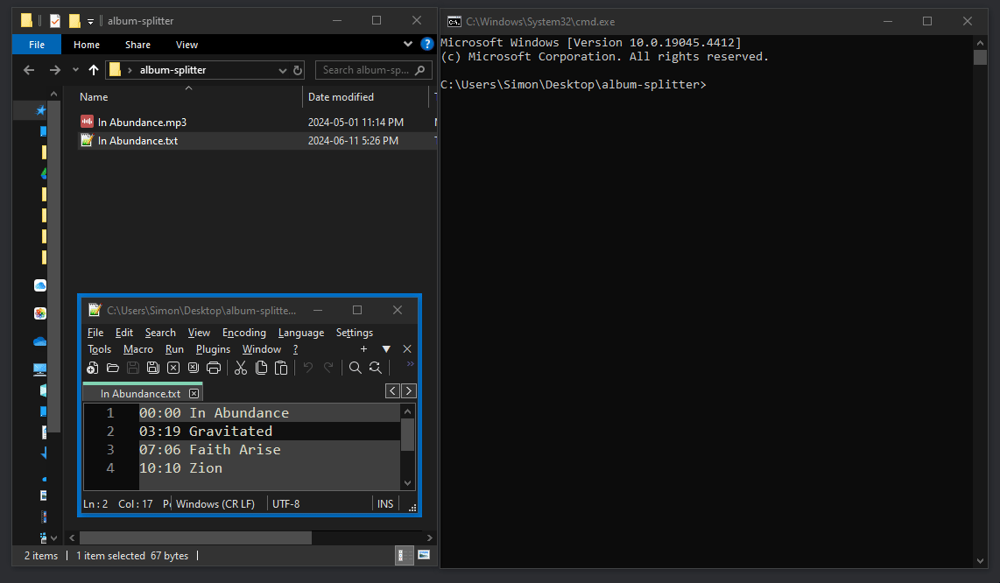

# Album Splitter

<p align="center">
    
    
</p>

**Album Splitter** is a simple **CLI tool** to split .mp3s based on timestamps.

## Features

-   **Automatic splitting** based on timestamps
-   Supports **Left or Right-side** timestamps
-   Processes all .mp3s in folder
-   Optional deletion of original .mp3 after running

## Demo

<p align="center">
    
</p>

## Usage

```cmd
usage: album-splitter.py [-h] [-d | --delete | --no-delete]

Splits .mp3s based on timestamps if a .txt with the same name of the .mp3
is found

options:
  -h, --help            show this help message and exit
  -d, --delete, --no-delete
                        If True, deletes the original .mp3 after splitting
```
